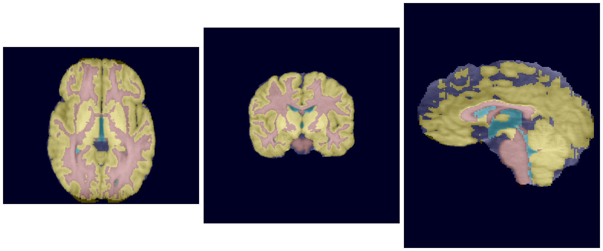
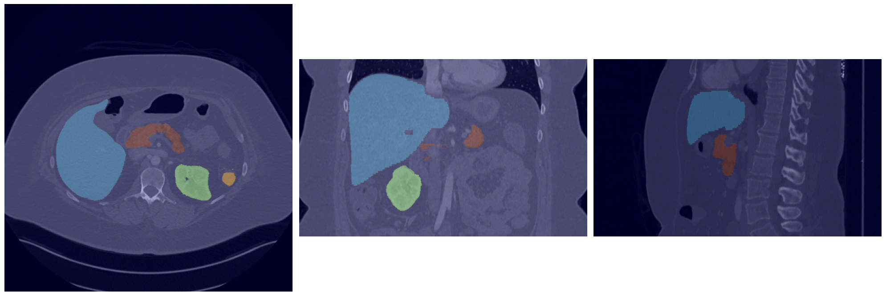
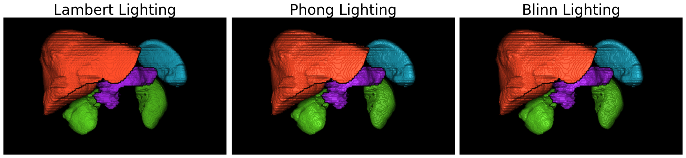
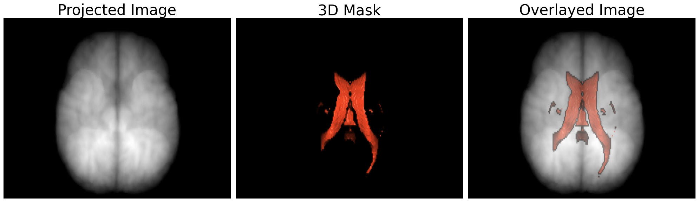
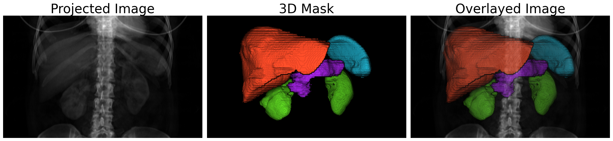

# First Hit Voxel Mask Projection

**Contributor**: Ahmed Gouda 

**Project Date**: 2026  

This repository implements a depth-weighted voxel projection renderer that converts 3D labeled voxel volumes into 2D RGB images with configurable lighting models (Lambert, Phong, Blinn-Phong).

The pipeline is fully NumPy-based, lightweight, and designed for scientific visualization, medical imaging, and voxel data inspection — not real-time graphics. It is is well suited for overlaying 3D segmentation masks on top of input images, preserving the projected mask dimensions without depth-based scaling. 

This renderer does not operate in mesh space: no meshes, triangles, or explicit geometric primitives are constructed. Shading is performed entirely in image space using a depth-weighted projection and surface normals estimated from the resulting 2D depth map. The method is not ray tracing, rasterization, or volume ray marching; instead, it relies on relative (ordering-based) depth rather than metric distance. As a result, the rendered output preserves the original spatial dimensions of the projection plane rather than appearing scaled by metric depth.

**Dataset**: [*IBSR18:* Internet Brain Segmentation Repository](https://www.nitrc.org/projects/ibsr), [*IBSR:* Internet Brain Segmentation Repository](https://www.nitrc.org/projects/ibsr), [*AbdomenCT_1K*](https://github.com/JunMa11/AbdomenCT-1K)

 
## Input Examples 

   
     
## Generated 3D Brain Masks 

    
## Lighting Models 
While inspired by classical lighting and volume visualization literature, this implementation performs shading entirely in image space and does not implement mesh-based rendering or physical light transport.
 
 

## Brain CSF Overlay Example 

 

## Organs Overlay Example 

## References
● Phong, B. T. (1975) “*Illumination for Computer Generated Pictures*”, Communications of the ACM, 18(6), 311–317.
● Blinn, J. F. (1977) “*Models of Light Reflection for Computer Synthesized Pictures*”, SIGGRAPH.
● Horn, B. K. P. (1989) “*Height and Gradient from Shading*”, International Journal of Computer Vision.
● Levoy, M. (1988) “*Display of Surfaces from Volume Data*”, IEEE Computer Graphics and Applications.
● Hadwiger, M., Berger, C., Kniss, J., Rezk-Salama, C. (2006) “*Real-Time Volume Graphics*”, CRC Press.
● Kindlmann, G., Whitaker, R., Tasdizen, T., Möller, T. (2003) “*Curvature-Based Transfer Functions for Direct Volume Rendering*”, IEEE Visualization.